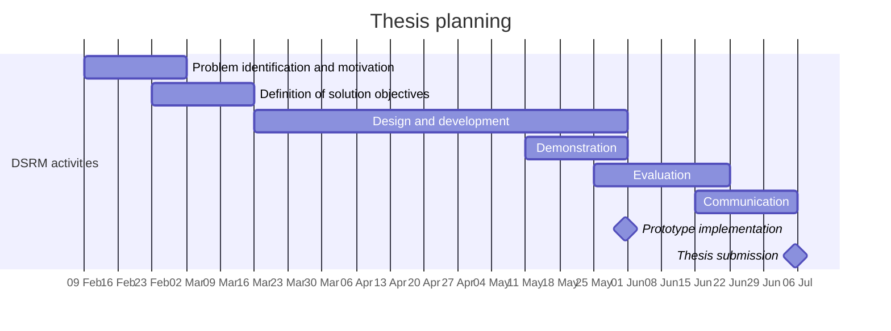

# Planning

High-level DSRM planning overview for the thesis project.

```mermaid
gantt
    title Thesis planning
    dateFormat  YYYY-MM-DD
    axisFormat  %d %b
    tickInterval 1week
    weekday monday

    section DSRM activities
    Problem identification and motivation :2026-02-09, 3w
    Definition of solution objectives :2026-02-23, 3w
    Design and development :2026-03-16, 11w
    Demonstration :2026-05-11, 3w
    Evaluation :2026-05-25, 4w
    Communication :2026-06-15, 3w
    Prototype implementation :milestone, 2026-05-31, 1d
    Thesis submission :milestone, 2026-07-05, 1d
```
